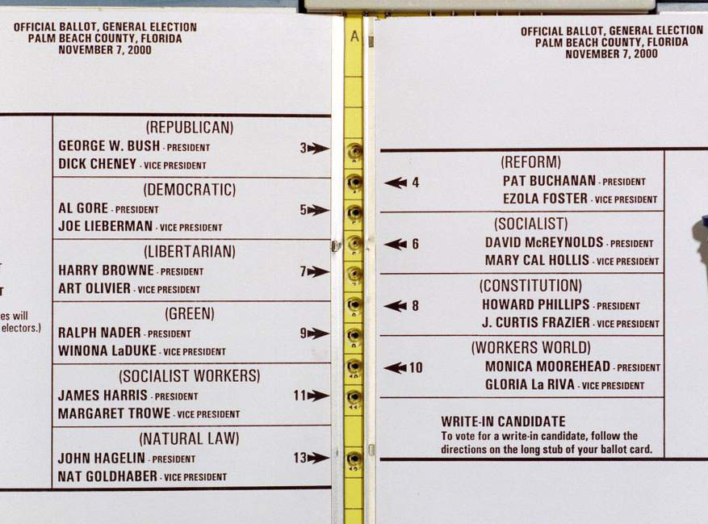

# Graduate Student Project: The Aberrant Vote for Buchanan in Palm Beach County

> *Note:* thanks to professors Deb Nolan and Jas Sekhon for providing a previous version of this project

The goal of this project is to examine what effect a particular paper ballot structure may have had on the results of the 2000 election in one county in one state that happened to change world history.

## Setup and logistics

**Due date:** The last commit for this project should be no later than *Wednesday, December 13th, at 11pm local (Pacific) Time*.

**Grade:** this assignment will be worth 10% of your total grade. I will rescale the original 100% from the syllabus to 90%.

**Work:** This extra project will be done *individually* by the graduate students in the course. 

**Repository name:** Name your repo `pgrad-XXX`, where `XXX` are the first three letters of your last name.

## Background information

In 2000, Al Gore and George W. Bush ran for president of the United States. Gore, the Democratic candidate, lost to Bush, the Republican candidate, by 537 votes Florida. If Gore had won in Florida, he would have been elected president. Many voters in Palm Beach County (PBC) Florida claimed that they mistakenly voted for Buchanan, the Reform party candidate, instead of Gore. Conventional wisdom says that few voters in PBC would cast their vote for Buchanan because it is a heavily Democratic county. In fact, Buchanan did not pay any visits to PBC prior to the election, and his campaign did not purchase any ads in the county. However, Buchanan received several thousand votes in PBC, which was quite a bit more than expected.

PBC had adopted a new ballot format for the 2000 election, and claims were that this new format had misled voters.

For this project you will consider the question: Is there strong evidence that votes were miscast?

### The Butterfly Ballot

The butterfly ballot, shown in the figure below, has a distinctive format.
It is called a 'butterfly' because it has two columns of candidate names
(the wings) with a column of punch holes in between (the body).  These punch holes are alternating in that the top punch hole corresponds to the first candidate in the left-hand column, the next  punch hole aligns with the first candidate on the right-hand side, the punch hole below that is for the second candidate on the left, and so on.
For this particular ballot, the first punch hole (see the figure below) corresponds to Bush, the second punch hole is for Buchanan (the first candidate on the right), and the third punch hole aligns with Gore, who is the second candidate on the left.

Voters claimed that they mistakenly punched the second hole in the column (i.e., the punch hole for Buchanan) when they thought they
were voting for the second candidate on the left (Gore).

## Assignment

The assignment consists of two parts:

1. **Reading:** Submit a reading report of the two papers included in the `papers` directory: "Law and Data: the Butterfly Ballot Episode" and "The Butterfly Did It: The Aberrant Vote for Buchanan in Palm Beach County, Florida".

   You will have a much easier time with the later analysis if you complete the reading first. In fact, the analysis we're asking you to do here is only a subset of the resarch published in the second paper (the first is an account of this crazy episode in American history).

   Include in your repo a `reading.md` file with your report. For each paper, include a one paragraph summary and one or two paragraphs of original discussion.

   Side note: two of the authors of these papers are faculty at Berkeley (H. Brady is the dean of the Goldman School of Public Policy and J. Sekhon is professor in Statistics and Political Science). 

2. **Data analysis:** You will examine the voting patterns and try to ascertain whether the butterfly ballot in PBC cost Gore the presidency, as per the instructions below.

### Buchanan's vote share in Palm Beach County

More specifically, consider the following questions:

- Do the raw vote counts give any evidence that the vote in PBC for Buchanan is different?
    - Is the vote for Buchanan in PBC large relative to other counties?
    - Is the vote for Buchanan large or small in the context of the total number of voters in the county?
  
- Do the proportions of the vote for Buchanan tell a different story?
    - Is Buchanan's vote share in PBC large relative to other counties?
    - Is Buchanan's vote share large or small in the context of the total number of voters in the county?
  
### A natural experiment

In PBC, the absentee ballot did not use the butterfly format. This means that we have a natural experiment: one group of PBC voters used a butterfly ballot and another group did not.  With these data we you can address the question: How does Buchanan's support in PBC on election day compare to his support in absentee ballots?

Consider the following questions:

- In what way do we have a natural experiment?
    - What assumptions do we have to make if we compare in-person election day votes vs absentee ballot votes?

- How does PBC compare to other counties when comparing election day and absentee ballots?
    - Accounting for the variation we expect in vote proportions, is Buchanan's vote share in PBC, the only county with the butterfly ballot, large?
    - Interpret your result.

### Assignment logistics

- The data is provided in a directory called `data/`.
- There is a `fig/` directory which contains a figure showing the butterfly ballot. Save your figures into this directory.
- Create one **clean** notebook with all your analysis, and which answers the questions and addresses the central question of whether the butterfly ballot had an effect on the election. This notebook should contain compelling figures as evidence for your argument.
- As in Project 2, create an `environment.yml` file with creates an environment called `butterfly`, with all necessary dependencies to run the code. Also, you will create a Makefile with `env` and `all` targets. The `env` target should make the environemnt with all necessary libraries, and the `all` target should run the notebook.

### Notes

#### Overdispersion of the binomial

You may assume that the number of votes for Buchanan in a county follows a Binomial$(n_c, p)$ distribution, where $p$ is Buchanan's "true" total vote share, and $n_c$ is the number of votes in county $c$. However, the binomial distribution might not accurately capture the voting process because different groups of people often behave differently when casting their votes. That is, voters of the same gender, race, and location tend to have similar voting patterns, and these patterns often differ from voters in other groups. 

A more reasonable model typically has a voter's support depend on the group to which they belong. In this situation, the variability in counts tends to be larger than described by the binomial (i.e., larger than $\sqrt{np(1-p)}$). This phenomenon is called over-dispersion. 

Researchers have estimated the over-dispersion for the 2000 presidential race to be about a factor of 3.8, i.e., the standard deviation is about 3.8 times larger than that calculated from the simple binomial. Be sure to use this factor to correct the estimate of the SD of the proportion of votes for Buchanan in each of the counties when accounting for the variability in Buchanan's vote share.
